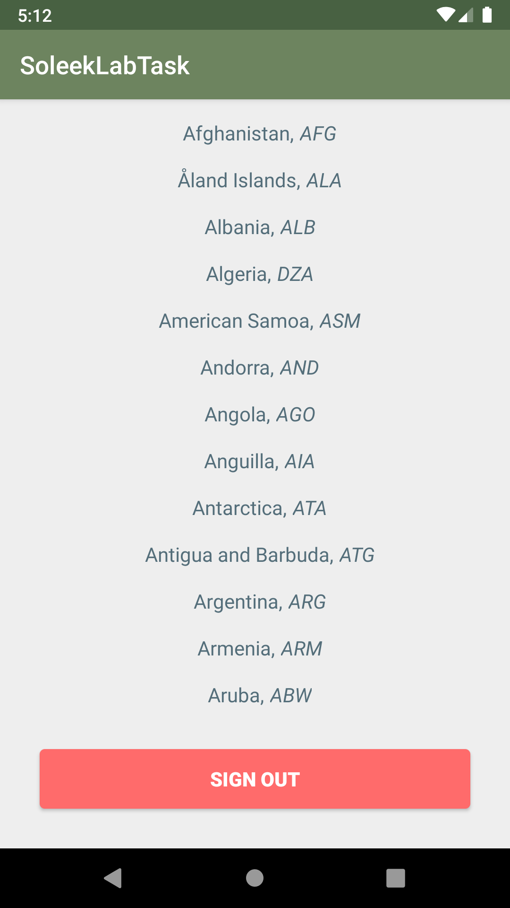

# SoleekTask

<p align="center"></p>
<p align="center" text> <b>Authentication form for Android</p>

<p align="center">
  
  
  <a href="https://github.com/ChmaraX/logregform-android/blob/master/LICENSE"></a>
</p>

## Features
 
- [ ] Welcome splash screen
- [x] Facebook login
- [x] Google login
- [x] Login activity with email/password, remembering logged user.
- [x] Wrong inputs errors


<br>

## Samples
### Login & Registration
<p align="center">
    
</p>

#### Using Google
<p align="center">
  
</p>

#### Using Facebook
<p align="center">
  
</p>

### Home
<p align="center">
  
</p>
  
<br>

## Basic Overview
>Android authentication form based on Firebase.

<br>

## Implementation
#### Retrofit
[Retrofit](https://github.com/square/retrofit/tree/master/retrofit-converters/gson) is a Converter which uses Gson for serialization to and from JSON. Used to deserlize data retreived from the [API](https://restcountries.eu/rest/v2/).

#### google-services.json
You need to set up your own [Firebase](https://firebase.google.com/) authenticator + database and download `google-services.json` file, then add it to `YourApp/app` folder:

The dependencies are already set up.

``` Gradle
dependencies {
    .
    .
    .
    // authentication
    implementation 'com.google.firebase:firebase-auth:17.0.0'
    implementation 'com.google.android.gms:play-services-auth:16.0.1'
    implementation 'com.facebook.android:facebook-login:5.0.1'

    // GSON Converter
    implementation 'com.squareup.retrofit2:retrofit:2.5.0'
    implementation 'com.squareup.retrofit2:converter-gson:2.5.0'
}
```
